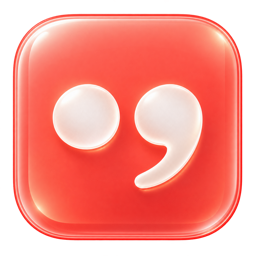
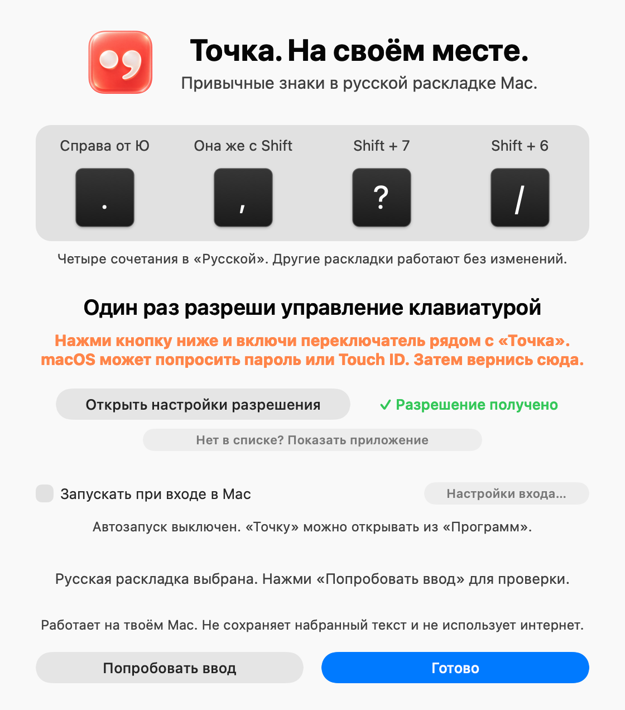

<p align="center"></p>

<h1 align="center">Точка</h1>

<p align="center">Привычные знаки препинания в русской раскладке Mac.<br>
Бесплатно, открытый код, без интернета.</p>

<p align="center"><a href="https://github.com/rolexx671/Tochka/releases/latest/download/Tochka.dmg"><b>Скачать для macOS</b></a> · <a href="https://rolexx671.github.io/Tochka/">Сайт</a> · <a href="PRIVACY.md">Конфиденциальность</a></p>

---

В стандартной «Русской» раскладке Mac точка и запятая спрятаны за Shift+7 и Shift+6. «Точка» возвращает их на место, как на ПК:

| Клавиша | Было | Стало |
| --- | --- | --- |
| Справа от Ю | `/` | `.` |
| Shift + справа от Ю | `?` | `,` |
| Shift + 7 | `.` | `?` |
| Shift + 6 | `,` | `/` |

Работает только в стандартной раскладке «Русская» (`com.apple.keylayout.Russian`). Английская, «Русская — ПК», фонетическая и любые другие раскладки не меняются. Сочетания с Command, Control, Option и Fn тоже не трогаются, поэтому `⌘/` и подобные шорткаты работают как раньше.

<p align="center"></p>

## Установка

1. Скачай [`Tochka.dmg`](https://github.com/rolexx671/Tochka/releases/latest/download/Tochka.dmg) и открой его.
2. Перетащи «Точку» в «Программы» и запусти её оттуда.
3. При первом запуске macOS скажет, что не может проверить разработчика. Открой **Системные настройки → Конфиденциальность и безопасность**, прокрути вниз и нажми **«Всё равно открыть»**. [Почему так →](PRIVACY.md#почему-macos-предупреждает-при-первом-запуске)
4. В окне «Точки» нажми **«Открыть разрешение macOS»** и включи переключатель рядом с «Точка».

Требования: macOS 13 Ventura или новее, Apple Silicon или Intel.

**Управление.** Значок в строке меню: левый клик включает и выключает «Точку», правый клик или Ctrl+клик открывает меню.

**Удаление.** Выбери в меню значка «Завершить «Точку»», перемести приложение из «Программ» в Корзину и убери его из списка в «Конфиденциальность и безопасность → Универсальный доступ».

## Почему этому можно доверять

- **Не записывает ввод и не выходит в интернет.** Что именно делает приложение с нажатиями, со ссылками на строки кода — в [PRIVACY.md](PRIVACY.md).
- **Маленький и читаемый код.** Около 700 строк на Swift и только системные библиотеки Apple, без сторонних зависимостей.
- **Сборку делает GitHub, а не автор.** Файл в релизах собирает [GitHub Actions](.github/workflows/release.yml) из этого репозитория и подписывает аттестацией происхождения. Проверить:
  ```sh
  gh attestation verify Tochka.dmg --repo rolexx671/Tochka
  ```
- **Можно собрать самому** (нужны только Command Line Tools):
  ```sh
  git clone https://github.com/rolexx671/Tochka.git && cd Tochka
  bash scripts/test.sh
  bash scripts/package-dmg.sh   # → dist/Tochka.dmg
  ```

## Разработка

| Путь | Что там |
| --- | --- |
| `Sources/Remapping.swift` | правила замены и обработчик нажатий |
| `Sources/main.swift` | значок в строке меню, подключение к клавиатуре |
| `Sources/SetupWindow.swift` | окно настройки |
| `Sources/Startup.swift` | автозапуск через `SMAppService` |
| `Tests/` | тесты; запуск: `bash scripts/test.sh` |
| `scripts/version.env` | номер версии |
| `docs/` | сайт (GitHub Pages) |

Скриншоты окна для сайта: `TOCHKA_PREVIEW=1 bash scripts/build.sh`, затем `build/Точка.app/Contents/MacOS/Tochka --preview-setup --preview-ready docs/img/setup-light.png` (добавь `--dark` для тёмной темы). В релизную сборку режим предпросмотра не попадает.

**Выпуск версии:** поменяй номер в `scripts/version.env`, сделай коммит и отправь тег `v<версия>`, например `git tag v1.4 && git push origin v1.4`. Остальное сделает [release.yml](.github/workflows/release.yml).

## Лицензия

[MIT](LICENSE). Программа предоставляется как есть, без гарантий.
